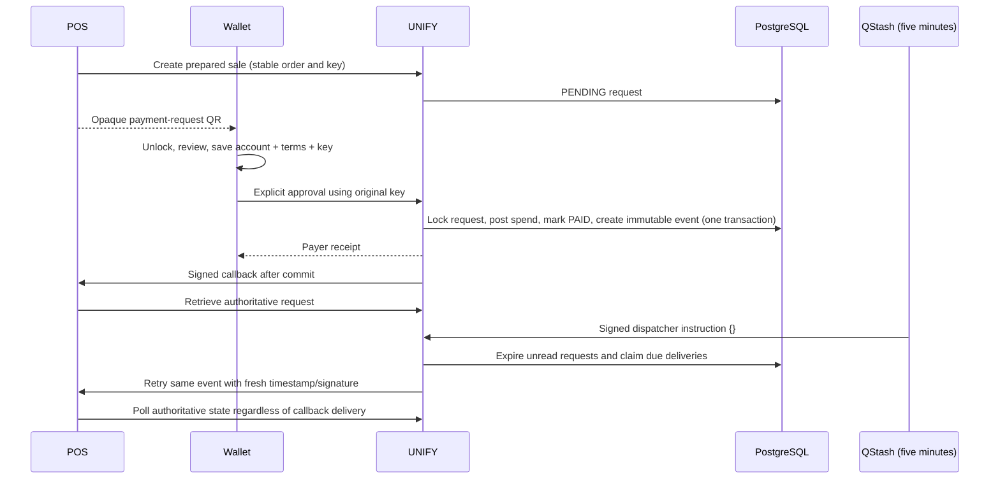

# Reliable checkout: merchant integration and operations

This increment groups AD-212, AD-215, AD-216, AD-217, AD-220, AD-224, AD-225 and AD-227. OTP onboarding changes remain outside its scope. Refunds and the `payment_request.refunded` callback were added later by [REFUNDS_OVERDRAFT_PAYOUTS.md](payments/REFUNDS_OVERDRAFT_PAYOUTS.md). The POS uses test money, TechNest and its explicitly approved Rondebosch Branch.



## Payment callback contract

Payment callback configuration is separate from verification callback configuration. Only an approved vendor owner can access these cookie-authenticated routes:

| Route beneath `/api/vendor/integrations/payment-webhook` | Purpose |
|---|---|
| `GET /` | Read latest configuration; never returns the secret |
| `PUT /` | Replace using `{ "url": "https://receiver.example/events", "branchIds": ["approved-branch-id"] }`; returns the new signing secret once |
| `DELETE /` | Disable and park outstanding deliveries |
| `GET /history?limit=20&cursor=event-id` | Paginated immutable events, attempts, next retry, last success and oldest outstanding delivery |
| `POST /events/{eventId}/retry` | Explicitly queue this event to the current enabled destination for its branch |

Mutations require a same-origin `Origin` header. Configuration replacement rotates the signing secret and creates a new revision. Existing verification settings and signatures are unchanged. API key revocation is independent of callback configuration and sale cancellation.

Headers for payment events:

```
X-Unify-Event-Id: immutable-event-uuid
X-Unify-Timestamp: unix-seconds
X-Unify-Signature: sha256=lowercase-hex-hmac
Content-Type: application/json
```

Example body (whitespace/order shown here is illustrative; verify the received raw bytes):

```json
{
  "id": "5a26a577-b91c-4b0a-b3fc-413698a7b0cb",
  "version": 1,
  "type": "payment_request.paid",
  "occurredAt": "2026-09-30T12:00:00.000Z",
  "data": {
    "requestId": "aBcdEF0123456789aBcdEF0123456789",
    "branchId": "approved-branch-id",
    "orderReference": "sale-001",
    "amountMinor": 3500,
    "currency": "ZAR",
    "status": "PAID",
    "transactionId": "wallet-transaction-id",
    "completedAt": "2026-09-30T12:00:00.000Z"
  }
}
```

`payment_request.cancelled` / `payment_request.expired` have matching terminal statuses and null transaction/completion fields. No student identity, payer ID or credential attributes appear in these events.

`payment_request.refunded` (version 1) is emitted once per completed refund on a payment request, whether the refund came from the POS API or the vendor portal, and is created in the same database transaction as the refund. A request has exactly one terminal event and may have any number of refund events. `amountMinor` stays the original sale amount; `refundedMinor` / `refundableMinor` are cumulative as of this refund:

```json
{
  "id": "event-uuid",
  "version": 1,
  "type": "payment_request.refunded",
  "occurredAt": "2026-10-06T12:00:00.000Z",
  "data": {
    "requestId": "aBcdEF0123456789aBcdEF0123456789",
    "branchId": "approved-branch-id",
    "orderReference": "sale-001",
    "amountMinor": 5000,
    "currency": "ZAR",
    "status": "PAID",
    "transactionId": "original-spend-id",
    "completedAt": "2026-10-06T11:00:00.000Z",
    "refund": { "id": "refund-transaction-id", "amountMinor": 3500, "source": "PORTAL", "createdAt": "2026-10-06T12:00:00.000Z" },
    "refundedMinor": 3500,
    "refundableMinor": 1500
  }
}
```

Later refunds may already exist by the time the receiver rereads the request. Accept a refund event only when the authoritative request's `refunds[]` contains `refund.id` with the same `amountMinor`, its `refundedMinor` is at least `data.refundedMinor`, and branch, request ID and order reference match.

Node verification example:

```js
import { createHmac, timingSafeEqual } from "node:crypto";
function verify(rawBody, timestamp, signature, secret) {
  if (!/^\d{10}$/.test(timestamp ?? "") || !/^sha256=[a-f0-9]{64}$/.test(signature ?? "")) return false;
  if (Math.abs(Math.floor(Date.now() / 1000) - Number(timestamp)) > 300) return false;
  const expected = createHmac("sha256", secret).update(`${timestamp}.${rawBody}`).digest();
  return timingSafeEqual(expected, Buffer.from(signature.slice(7), "hex"));
}
```

Validate the version, event type, configured branch and immutable terms, then retrieve `GET /api/vendor/v1/payment-requests/{id}` using a server-held scoped key. Compare amount, order reference, currency, status and applicable transaction/completion fields. Return 2xx only after acceptance. Do not treat callback arrival or browser timeouts as financial proof.

A callback may arrive more than once or after a lost acknowledgement. Store its event ID in a real merchant system's durable deduplication table before performing additional order fulfilment. The stateless POS simulator safely rereads UNIFY on every delivery and performs no fulfilment side effects. Keep polling as a fallback; only an authoritative `PAID` state enables the receipt.

## Delivery and failure recovery

The migration's terminal-state trigger commits one immutable event with the request outcome. A callback never runs inside the financial transaction. Due deliveries use fenced 60-second leases, at most 20 per dispatcher run and four simultaneous outbound connections. HTTPS calls, including DNS resolution, have a three-second deadline. Every attempt validates public addresses and pins the connection to a validated address while verifying the original TLS hostname. Private/reserved addresses, credentials in URLs, non-443 ports and redirects are rejected. Response bodies are discarded; stored errors are sanitised codes.

Six automatic attempts are allowed: initial, then failure delays of 5 minutes, 15 minutes, 1 hour, 6 hours and 24 hours. Interrupted leases are recovered with a new token; stale workers cannot overwrite the new result. Exhausted events remain visible and can be explicitly retried. Manual retry starts a fresh six-attempt budget while preserving attempt numbering/history and the same event ID. The history displays the latest 20 attempts per event.

Disabling or replacing configuration parks outstanding work. An in-flight HTTPS request may finish at the old destination; its attempt remains recorded, and its stale lease cannot reactivate parked work. Old events move to a replacement destination only through an explicit owner retry.

The dispatcher also expires up to 100 unread pending requests each run. Normal request reads and mutations continue enforcing ten-minute server-time expiry even with the scheduler unavailable.

## QStash setup

Deploy the portal endpoint first. Configure server-only Vercel environment values `QSTASH_CURRENT_SIGNING_KEY`, `QSTASH_NEXT_SIGNING_KEY` and the exact canonical `PAYMENT_WEBHOOK_DISPATCH_URL` (production: `https://voskuils.com/api/jobs/payment-webhooks`). The dispatcher verifies QStash signatures using the official receiver, including URL and raw-body claims; unsigned requests cannot dispatch work.

Set `QSTASH_TOKEN` only in the private setup environment, then run:

```sh
node scripts/configure-payment-webhook-schedule.mjs
```

This idempotently configures schedule `unify-payment-webhooks`, `*/5 * * * *` UTC, body `{}` and one scheduler-message retry. Financial event bodies never go through QStash. Nominal usage is 288 scheduler messages/day, or 576 including one retry each. Check the account's total free-tier usage before adding other schedules. [QStash pricing](https://upstash.com/pricing/qstash), [schedule API](https://upstash.com/docs/qstash/api-reference/schedules/create-a-schedule), [signature verification](https://upstash.com/docs/qstash/features/security).

## Wallet recovery contract

Authenticated balance responses include opaque `walletAccountId`. POS checkouts persist their reference, original key, immutable terms, account and submission phase before transmitting payment. Lifecycle recovery never submits automatically.

* `GET /api/wallet/v1/payments/by-reference/{idempotencyKey}` returns the caller's completed receipt or `{ "status": "NOT_RECORDED" }`.
* `GET /api/wallet/v1/payments/{transactionId}/receipt` returns only the payer's completed receipt; foreign transactions return `RECEIPT_NOT_FOUND`.
* Prepared sales retain their payer-only request receipt and resolve endpoints. Another payer's completed sale displays “Already paid” without exposing a receipt.

`NOT_RECORDED` is not proof of failure. Explicit retry uses the same key and unchanged payment terms. Account switching blocks recovery/submission under the wrong account. Old POS references preserve their IDs and keys; previously submitted records without an account binding can recover a recorded receipt but cannot safely acquire an invented binding for another submission. Sign-out still clears local pending state; completed receipts remain recoverable from the authenticated activity list.

## Rollout and coordinated phone demo

1. CI must pass portal lint/types/unit tests, isolated PostgreSQL financial/outbox tests and build. Review the additive `20260930180000_payment_webhook_outbox` migration; deploy it and portal APIs through Vercel first. Keep preview migrations and wallet bootstrap disabled against the shared production database.
2. Deploy the POS receiver. In the TechNest owner portal, choose only Rondebosch Branch and the receiver URL `https://unify-pos-simulator.vercel.app/api/unify/payment-events`. Save the one-time signing secret as server-only `UNIFY_PAYMENT_WEBHOOK_SECRET` in the POS Vercel environment, then redeploy POS. Configure QStash after endpoint deployment.
3. Compile the signed phone-only wallet APK on Windows using the existing keystore. Verify certificate against portal asset links. EC2 continues hosting only the agent backend.
4. On the POS prepare a small itemised test-money sale. Scan on a locked phone, unlock, review vendor/branch/reference/total, explicitly approve and compare wallet, POS and portal transaction IDs, totals and completion times. Open the receipt again from wallet activity.
5. Interrupt connectivity immediately after approval, terminate/reopen the wallet, reconnect and recover. If UNIFY reports NOT_RECORDED, explicitly retry the same instruction. Confirm one spend and matching receipt.
6. Cancel a pending sale and scan its QR; demonstrate cancellation. Let another sale expire for ten minutes and verify both clients show expiry.
7. Manually retry a delivered event in owner history. Confirm duplicate delivery is accepted and no additional spend occurs. Disable callbacks/QStash temporarily and demonstrate that POS polling and wallet receipt recovery still work, then restore delivery.

Physical phone acceptance and individual Jira completion remain pending until these demonstrations are verified. Foundation PRs merge first; move only this chunk's commits onto updated main and retarget the stacked portal/wallet PRs. No ticket closes merely because its code appears in a grouped PR.

## POS-only continuation — 30 September 2026

Static payment destination and submission routes return HTTP 410 STATIC_PAYMENT_REMOVED. Vendor pages offer POS sales instead of printable payment QR codes. Historical receipt routes and verification QR codes remain available. Branch acceptance identifiers remain internal to dynamic POS eligibility; no destructive schema migration is required.

AD-156: existing timeout-aware activation remains in use. AD-158: existing bounded GET retries preserve one correlation ID; writes are not automatically retried. AD-159: incoming request IDs now propagate to agent calls and activation proxy response headers/error bodies. AD-210: existing student-number/OTP model is retained, with explicit expiry/device/attempt/single-use tests. Runtime bypass must be distinguished from true OTP phone acceptance.

QStash is configured on production, one five-minute signed schedule with one retry. Unattended expiry and callback delivery were observed. Phone account isolation, real OTP acceptance and controlled outage scenarios are still pending; tickets remain open and PRs draft.
